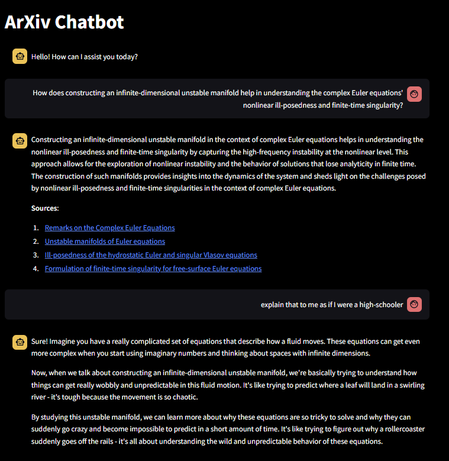
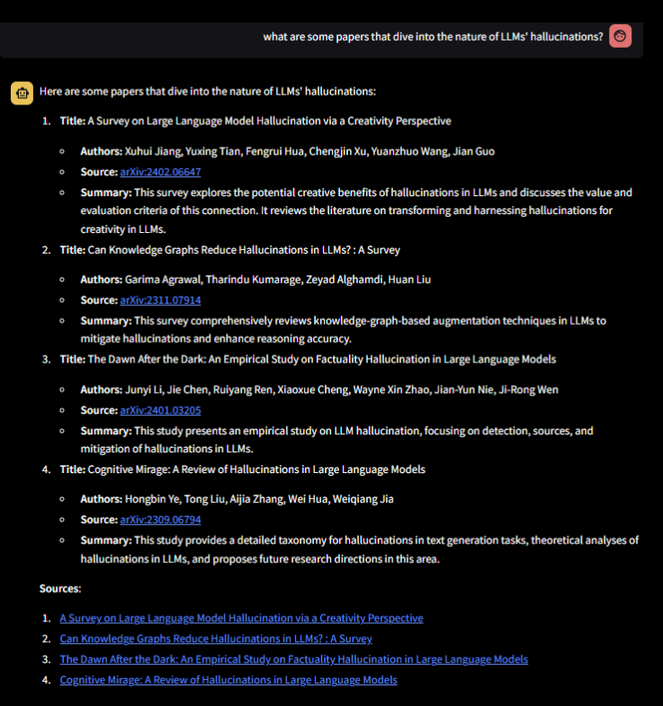

# ArXiv Chatbot

ArXiv Chatbot is a GPT-based RAG agent that can search 2.4 million ArXiv abstracts to answer all your scientific and technical questions. It has the potential to be more precise and have fewer hallucinations than ChatGPT (see Example 2 below). It also cites its sources! You can try it out at the following link (might take a few seconds to load since it's on  a free plan):

### [arxiv-chatbot.onrender.com](https://arxiv-chatbot.onrender.com/)

## Description

The frontend is a Python-based Streamlit app hosted on [Render](https://render.com/). The backend is a FastAPI app hosted using a Docker image on Google Cloud Run. The two are relatively independent, so if you would like access to the backend API for your own projects, **get in touch**!

Here are some more details about how this was constructed:

### Data

The dataset used is the [arXiv Dataset on Kaggle](https://www.kaggle.com/datasets/Cornell-University/arxiv/data)$^1$ containing metadata of ~2.4 million papers on the ArXiv. It was downloaded on June 8, 2024. It was processed and five features were selected: `id`, `title`, `authors`, `abstract` and `categories`. The data was then loaded using `langchain_community.document_loaders.DataFrameLoader` and upserted as a vector store into a [Pinecone Index](https://app.pinecone.io/) via a `langchain_pinecone.PineconeVectorStore` with the following settings:
* Embedding: [BAAI/bge-small-en-v1.5](https://huggingface.co/BAAI/bge-small-en-v1.5)
* `dimensions`: 384 (the dimension of our chosen embedding)
* `metric`: "dotproduct"

### Implementation

The chat bot is implemented as a custom wrapper around `langchain.agents.AgentExecutor` with the following components:
* OpenAI's `GPT-3.5-turbo` as the LLM,
* a `ConversationSummaryBufferMemory` (with a token limit of 650) to store conversation history, following [this guide](https://www.pinecone.io/learn/series/langchain/langchain-conversational-memory/)$^2$,
* a RAG (Retrieval Augmented Generation) chain using the previously constructed vector store and a `langchain.chains.ConversationChain`, following [this tutorial](https://python.langchain.com/v0.2/docs/tutorials/rag/#retrieval-and-generation-generate),
* an agent constructed using Langchain's `create_openai_function_agent` functionality, and
* the few-shot system prompt shown below:
        
        You are an intelligent agent equipped with a tool named "ArXiv-search" that can answer technical and scientific questions. When asked to answer a technical or scientific question, you should use "ArXiv-search" to handle the input.

        Instructions:
        1. If the input asks you to answer a technical or scientific question, use ArXiv-search".
        2. If the input is a general query, answer it to the best of your knowledge.

        Examples:
        - Input: "Which is the largest ocean?"
        Action: Answer "The Pacific Ocean".
        - Input: "What is quantum gravity?"
        Action: Use "ArXiv-search" to answer the question.

All of this can be viewed in `backend/query.py`.

### Deployment
The backend was deployed on Google Cloud Run using a Docker image following [this example](https://github.com/sekR4/FastAPI-on-Google-Cloud-Run)$^3$. The Dockerfile is at `backend/Dockerfile`.

## Evaluation

The agent was evaluated using [Ragas](https://docs.ragas.io/en/stable/index.html), a framework for evaluating RAG pipelines, using the guide [here](https://docs.ragas.io/en/stable/getstarted/index.html). The ambient test set consists of 87 papers randomly selected from the top 20 categories weighted by their frequency as follows:

| Categories | Dataset Count | Test set Count |
| --- | --- | --- |
| astro-ph | 86911 | 9 |
| hep-ph | 81203 | 9 |
| quant-ph | 69050 | 7 |
| hep-th | 58843 | 6 |
| cs.CV | 58285 | 6 |
| cond-mat.mtrl-sci | 39391 | 4 |
| cond-mat.mes-hall | 34931 | 4 |
| math.AP | 34165 | 4 |
| astro-ph.GA | 30646 | 4 |
| gr-qc | 30555 | 4 |
| math.CO | 29591 | 3 |
| astro-ph.SR | 26974 | 3 |
| cond-mat.str-el | 26111 | 3 |
| cs.CL | 24428 | 3 |
| math.PR | 23686 | 3 |
| astro-ph.HE | 23042 | 3 |
| cs.IT math.IT | 22775 | 3 |
| math.NT | 21971 | 3 |
| astro-ph.CO | 21941 | 3 |
| math.AG | 20245 | 3 |

The test set is available at `backend/test_papers.feather`.

A question-answer-context-ground truth test set consisting of 16 samples was generated using Ragas' test set generation functionality with `GPT-3.5-turbo` as the LLM and OpenAI's `text-ada-embedding-002-v2` as the embedding. The answers generated by the RAG agent were then evaluated using `ragas.evaluate` (again with `GPT-3.5-turbo`) with the following results:

| **Metric**           | **Score** |
|----------------------|-----------|
| `answer_relevancy`   | 0.9494    |
| `answer_correctness` | 0.6239    |
| `answer_similarity`  | 0.9308    |
| `faithfulness`       | 0.8448    |
| `context_recall`     | 0.8593    |
| `context_precision`  | 0.9784    |

All of the evaluation functionality is in `backend/ragas_test.py`.

There are two obvious drawbacks with this approach:
* The test sample size of 16 is quite small. Unfortunately the Ragas's generation process is quite token-heavy and those tokens cost money.
* The same LLM (`GPT-3.5-turbo`) is used in all three steps of the process: for generating the test set, for making the predictions of the model (since the RAG agent uses it), and for calculating the evaluation metrics. So in some sense these results are just the LLM using itself to evaluate its own performance with itself as the benchmark. Future work should involve using different LLMs for all three steps.

## Examples

1. This example shows how the chat bot follows the prompt above to use RAG to answer the initial question, and then its native LLM capabilities to answer the follow-up:

2. Here is a comparison of the ArXiv chatbot with ChatGPT. The following is a screenshot of a conversation with the ArXiv chatbot on June 16, 2024:

The papers are real papers, the author list is accurate, the links are accurate and the summaries are faithful. The cited sources match exactly with the papers listed in the answer. Compare this with the following conversation with ChatGPT (on the same day) using GPT-4o:

https://chatgpt.com/share/4837cd60-25f0-4521-bf85-0231eb37746d.

While there are more sources provided and the titles are of actual papers, the following errors occur in some of the sources:
* author list inaccurate,
* link nonexistent or inaccurate, or
* paper does not match link.

The papers are also somewhat older (probably due to the cutoff date for training data for ChatGPT).

## References

1. arXiv.org submitters. (2024). [arXiv Dataset](https://doi.org/10.34740/KAGGLE/DSV/7548853). Kaggle. 

2. James Briggs and Francisco Ingham. [LangChain AI Handbook](https://www.pinecone.io/learn/series/langchain/).

3. Sebastian Kraus. Deploying a FastAPI app on Google Cloud Run.

